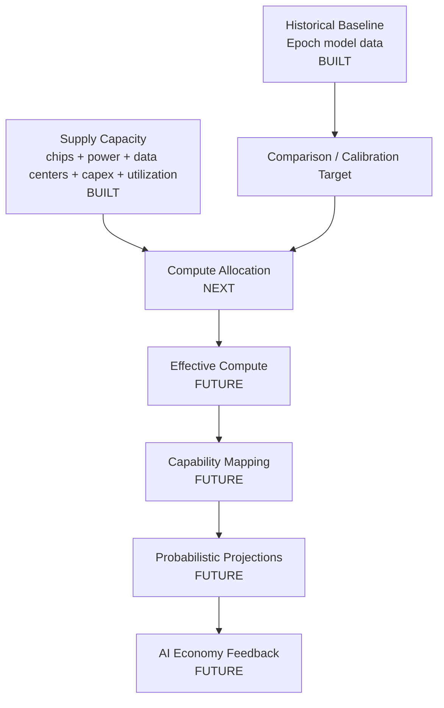

# Model Map

How the project's components fit together — what's built, what's next, what's
deferred, and how data flows between them.

## 1. Full model stack



Two boxes are **built** today (historical baseline and supply-capacity model).
The next layer is **compute allocation**, which bridges the gap between the
two and emits the missing quantity: `largest_frontier_run_flop_by_year`.
Everything beyond allocation is deferred.

## 2. Built vs next vs future

| Component | Status | Run command | Output entry point |
|---|---|---|---|
| Historical baseline | ✓ built | `uv run historical` | `outputs/tables/historical_trend_estimates.csv` |
| Supply capacity model | ✓ built | `uv run supply` | `outputs/tables/supply_fundamental_inputs_by_year.csv` |
| Compute allocation | ✗ next | — | (`largest_frontier_run_flop_by_year`, planned) |
| Effective compute | ✗ future | — | — |
| Capability mapping | ✗ future | — | — |
| Probabilistic projections | ✗ future | — | — |
| Economy feedback | ✗ future | — | — |

For per-component inputs/outputs/contracts see [`component_contracts.md`](component_contracts.md).
For per-output-file interpretation see [`output_guide.md`](output_guide.md).

## 3. Data flow

The forward causal chain on its own (excluding the historical-baseline
calibration arrow):


Read this as: physical and financial inputs → total annual usable compute →
allocated across uses → the largest single training run → adjusted for
algorithmic improvements → mapped to capabilities → economic feedback that
flows back into capex on the input side.

The two existing components sit at the *left edge* of this chain. The
allocation layer is the next box to the right. Everything past the
"largest frontier training run" node is currently a placeholder.

## 4. Historical baseline vs forward model

The single most important conceptual point in this repo.

| | Historical baseline | Supply capacity model |
|---|---|---|
| **Asks** | What did the largest single frontier training runs *do* historically? | How much total AI compute *can exist* per year going forward? |
| **Time horizon** | 1950–2026 | 2024–2040 |
| **Quantity** | FLOP per single training run | FLOP per year, total global usable AI compute |
| **Source** | Epoch's "Notable AI Models" dataset | Sourced + synthesized assumptions on chips, power, data centers, capex, utilization |
| **Headline number** | 5.97× per year, Rule A 2018+ frontier-run trend | 45.7%/yr CAGR (base scenario), 1.65e+31 FLOP/yr by 2040 |
| **Role in the model** | Calibration / comparison target | Forward causal model |

These are **different quantities**. Comparing them directly — e.g. asking
"why is the supply model's growth rate slower than the historical trend?" —
is the most common reading mistake. The historical trend tracks one
training run's compute, which is a *share* of total usable compute. The
share has grown over time: in 2018 a frontier run was a tiny fraction of
global AI compute; in 2024 it's a much larger fraction. So a single trend
can outpace total-supply growth for a while without contradiction.

> **Historical baseline = single frontier training runs.**
> **Supply capacity model = all global usable AI compute.**
> **They are not directly comparable as forecasts.**

## 5. Why the allocation layer is next

The historical baseline gave us "frontier runs grew at X×/yr." The supply
model gives us "total usable compute will grow at Y%/yr." Bridging these
requires modeling the *share* of total usable compute that goes to the
largest single training run.

The allocation layer must split annual usable compute across:

- **Training** (including the largest single frontier run, plus smaller runs)
- **Inference** (production serving)
- **AI R&D experiments** (post-training, evals, ablations, safety)
- **Reserves** (unallocated / fragmented capacity)

Once the largest-frontier-run share is modeled, the supply-capacity model's
trajectory can be translated into a forward frontier-run trajectory and
compared apples-to-apples with the historical trend.

The expected primary output of the allocation layer is:

```text
largest_frontier_run_flop_by_year
```

This is the bridge between the supply model's total-annual-compute trend
and the historical baseline's single-frontier-run trend. Until allocation
is built, the gap between historical 5.97×/yr and supply ~50%/yr CAGR
cannot be reconciled — and any forecast that treats the historical trend
as a forecast of total compute (or vice versa) is wrong.

---

## Appendix: file-level architecture

```
pipelines/historical.py    →  Builds historical-baseline outputs
pipelines/supply.py        →  Builds supply-capacity outputs
                             (next: pipelines/allocation.py)

model/                     →  Reusable engine code
  runtime.py               (shared paths, colors, attribution)
  data_cleaning.py         (historical: Epoch CSV → processed schema)
  frontier_filters.py      (historical: Rules A/B/C)
  trend_fitting.py         (historical: log-linear fits)
  historical_charts.py     (historical: chart helpers)
  supply_engine.py         (supply: H100-eq stock + 4 limits + utilization)
                             (next: model/allocation_engine.py)
```

Inputs live in `data/raw/` (immutable) and `data/assumptions/`
(scenario-keyed YAML). Processed datasets land in `data/processed/`.
Outputs go to `outputs/charts/` (PNG) and `outputs/tables/` (CSV).
