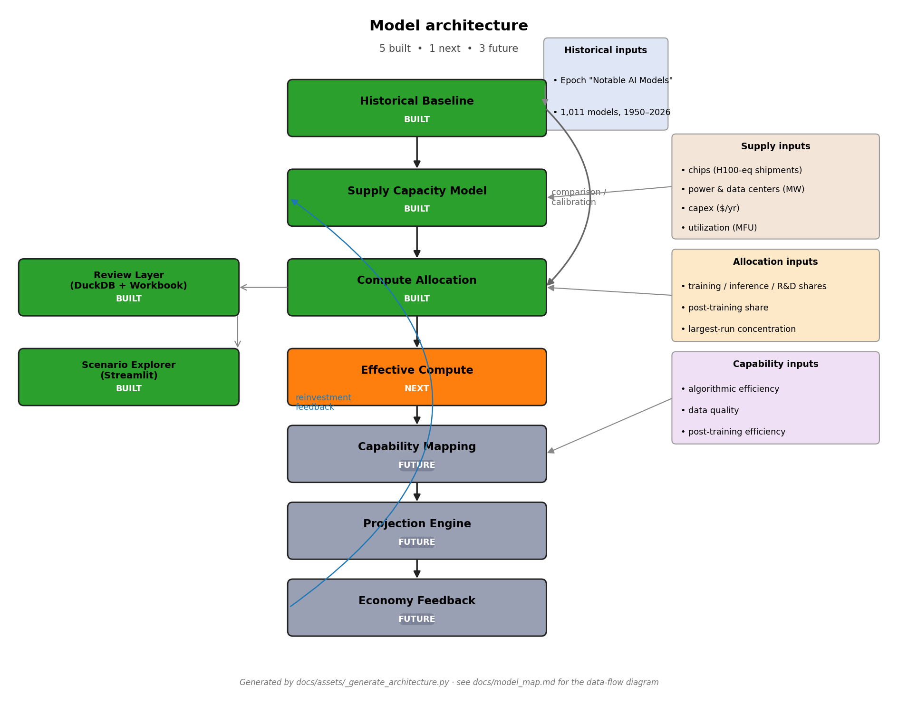

# Model Walkthrough

A guided tour through the actual outputs of the two built components.
Each section shows what's there, points at the relevant artifact, and
gives a copy-pasteable snippet to load it.

This is the *show me the model* document. If you want the conceptual
explanation, read [`executive_summary.md`](executive_summary.md) and
[`model_map.md`](model_map.md) first.

---

## 1. What the model currently includes

Two components produce outputs:

- **Historical baseline** (`uv run historical`) — empirical fits on
  Epoch's "Notable AI Models" dataset (1,011 rows, 1950–2026).
- **Supply capacity model** (`uv run supply`) — forward projection
  2024–2040 across four scenarios.

Five layers are *not* yet built (allocation, effective compute,
capability mapping, projection engine, economy feedback). They are
the right side of the architecture diagram below.



For per-component contracts see
[`component_contracts.md`](component_contracts.md).

---

## 2. Load historical trend outputs

The headline historical artifact is the trend-estimates table.

```python
import pandas as pd

trends = pd.read_csv("outputs/tables/historical_trend_estimates.csv")

# Headline: Rule A 2018+ training compute
rule_a = trends[
    (trends["trend_name"] == "training_compute")
    & (trends["frontier_rule"] == "frontier_rule_a_2018+")
].iloc[0]

print(f"{rule_a['annual_growth_multiplier']:.2f}× per year, "
      f"R²={rule_a['r_squared']:.2f}, n={rule_a['n_models']}")
# → 5.97× per year, R²=0.84, n=113
```

The full table has 45 rows: 5 trend types (compute / 3 cost variants /
cost-per-FLOP) × 9 frontier-rule and time-window combinations. See
[`output_guide.md`](output_guide.md#outputstableshistorical_trend_estimatescsv)
for column-by-column documentation.

The processed model-level data is at
`data/processed/historical_models.{csv,parquet}` (1,011 rows × 35 cols)
if you want to inspect or re-fit.

---

## 3. Load supply capacity outputs

The headline supply artifact is the year-by-year projection.

```python
import pandas as pd

supply = pd.read_csv("outputs/tables/supply_fundamental_inputs_by_year.csv")

# Base scenario, headline summary
base = supply[supply["scenario"] == "base_input_case"].set_index("year")

print(f"2024: {base.loc[2024, 'usable_compute_flop_year']:.2e} FLOP/yr")
print(f"2030: {base.loc[2030, 'usable_compute_flop_year']:.2e} FLOP/yr "
      f"(binding: {base.loc[2030, 'binding_constraint']})")
print(f"2040: {base.loc[2040, 'usable_compute_flop_year']:.2e} FLOP/yr")
# → 2024: 3.97e+28 FLOP/yr
# → 2030: 1.35e+30 FLOP/yr (binding: capex)
# → 2040: 1.65e+31 FLOP/yr
```

The four scenarios live in `scenarios/supply_*.yaml`. Their numerical
inputs come from `data/assumptions/supply_input_assumptions.yaml`; per-
input provenance is in [`input_provenance.md`](input_provenance.md).

---

## 4. Historical frontier training compute

The Rule A 2018+ trend visualised against all historical models in the
dataset:


Reading notes:

- Each dot is one model from Epoch's dataset, plotted at its publication
  date and training-compute FLOP.
- The dashed line is the Rule A 2018+ fit (5.97×/yr).
- "Frontier" here means *Rule A* — top-10 by compute within a 1-year
  rolling window at each model's release. Rules B and C give different
  slopes; see `historical_trend_estimates.csv` and
  [`historical_findings.md`](historical_findings.md) §4–5 for the rule-
  sensitivity comparison.

Other historical charts: by-organization breakdown, residuals, hardware
timeline, three cost variants. All under `outputs/charts/historical_*.png`.

---

## 5. Supply usable compute scenarios

The four scenarios visualised together:


Reading notes:

- Each line is one scenario's `usable_compute_flop_year` from 2024–2040.
- Y-axis is log-scale. The vertical spread between scenarios is roughly
  one order of magnitude by 2040.
- The base scenario (blue) is the recommended central case, anchored to
  Epoch's August 2024 scaling estimates and IEA's April 2025 *Energy
  and AI* report.

Companion chart showing which constraint binds in each year:


In the base and capex-rich scenarios, **capex** binds early then **chip**
takes over; in the chip-bottleneck scenario, chip binds throughout; in
the power/DC-bottleneck scenario, **datacenter** binds 2026–2040.

---

## 6. Why these are different quantities

The most common reading mistake is comparing the historical 5.97×/yr
trend to the supply 45.7%/yr CAGR as if they were forecasts of the same
thing.

| | Historical (Rule A 2018+) | Supply (base scenario) |
|---|---|---|
| **Quantity** | FLOP per single training run | FLOP per year, total global usable AI compute |
| **Time horizon** | 1950–2026 (descriptive fit) | 2024–2040 (projection) |
| **Headline** | 5.97× per year | 45.7% per year (CAGR) |
| **Source** | Epoch's "Notable AI Models" dataset | Sourced + synthesized inputs |
| **Role** | Calibration / comparison target | Forward causal model |

The combined chart, with the historical fit overlaid on the four
supply scenarios:


The historical extrapolation (dashed black) is roughly **10 OOM** above
even the most aggressive supply scenario by 2040. That gap is real and
informative — but it is *not* the historical trend "winning" against the
supply forecast. It's two different things being compared on one axis.

The historical trend is a *single training run's compute*. The supply
trend is *all global AI compute*. A frontier run consumes some share of
total compute, and that share has been growing (small in 2018, larger
in 2024).

---

## 7. The missing allocation bridge

To compare the two trends apples-to-apples, we need to know the
**share** of total annual usable compute that goes to the single
largest training run. That's what the allocation layer will do:

```text
largest_frontier_run_flop_t
    = usable_compute_flop_year_t           ← from supply model
      × training_share_t                    ← from allocation
      × largest_run_concentration_t         ← from allocation
```

With this in hand, the supply-capacity scenarios can be projected
forward as **single frontier-run trajectories**, directly comparable
with the historical Rule A 2018+ trend.

A backcast applied to 2018–2024 should approximately reproduce the
historical 5.97×/yr trend; if it doesn't, the allocation parameters
are mis-specified or the supply model is mis-anchored. That's the
calibration test the allocation layer's design must pass.

---

## 8. Preview of the planned allocation output shape

The proposed output table from the allocation layer:

```text
outputs/tables/largest_frontier_run_flop_by_year.csv

scenario              year   training_share   largest_run_concentration   largest_frontier_run_flop
base_input_case       2024   0.35             0.10                        1.39e+27
base_input_case       2025   0.36             0.11                        ...
...
chip_bottleneck       2030   0.30             0.15                        ...
...
```

Plus a chart overlaying the implied single-frontier-run FLOP from each
supply scenario against the historical Rule A 2018+ trend on the same
axes. This is the chart that finally makes the two layers comparable.

For the full spec see
[`component_contracts.md`](component_contracts.md#compute-allocation-layer).

---

## What to read next

- [`executive_summary.md`](executive_summary.md) — the one-pager.
- [`model_map.md`](model_map.md) — the architecture and data-flow diagrams.
- [`historical_findings.md`](historical_findings.md) — full historical-baseline memo with rule sensitivity, cost-variant analysis, and supply-capacity handoff parameters.
- [`supply_findings.md`](supply_findings.md) — full supply-capacity memo with sourced inputs, sensitivity bands, and allocation-layer handoff parameters.
- [`scope.md`](scope.md) — merged scope for both components.
